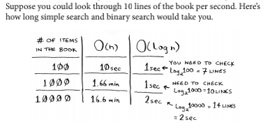

Peace, mercy and blessings of God be upon you. I am Muhammad al-Mahdi. Today, God willing, we will talk about a new
chapter from the book grokking algorithms entitled hash tables. In it, we will learn about a new data structure that is
the hash table and some of its uses and interior design, its advantages and disadvantages, and how to calculate the
performance Our hashtable

Let us suppose that we have a grocer, for example, and every time a customer comes to the seller, he must look at the
prices in the price book or the price list. And if this book is not arranged alphabetically, you will take a very, very
long time to find something that begins with the letter A and B, a biscuit, for example. And this is called Simple
Search, which we talked about in Chapter 1 and who was saying that if you have a group of elements that walk in order,
an element of an element until you find what you are looking for, and we said that this will be its complex O(N)

Ok if it was arranged alphabetically? I can still use Binary Search and my complex will be O(Log(N))
And as we agreed, this is a very big difference in time between the two

So let's say a quick reminder

As we know, the Binary will be very fast, but for the cashier, this will be very difficult, even if the book is arranged
for the cashier. What he really needs is that he memorizes all the names and prices, so you won't even go around and
answer the length of the answer from your brain without searching. I mean, from the other side, you get the data in O(1)
, so how do we do that?

We do not know anything but Arrays and lists, and we are not going to talk about the stack, because there is no such
thing as spraying in it, We can use arrays and make an arrays of pairs, and each pair keeps the name and price, and if
we arrange these arrays according to the name, we can answer the price in O(log(N))using Binary Search

I just want to connect with constant time here so there is something called hash functions

What is the hash function? A hash function, quite simply, is a function that takes a string and returns a number Let's
say, for example, that we have a few things in the shop

Biscuits - juice - salt - chips

and their prices will be 2 - 4 - 3 - 5

We can say that our hash function will take the name of the need and return a number that is the length of the word

So, we made our new data structure, called HashTable It will be my array, and according to my key, I will choose the
index in which my value will be placed.

Let's start writing the code for this talk

And this is how we finished our hashtable

Keep in mind that your language will have hashtable, so you do not need to write the hash function in your hands most of
the time.

Ok, the hash table can be used for a lot of things. Let us mention some of its uses

We can use it, for example, to make a phone book and keep the names and numbers of each person

We can use it to run an election process, for example Each one will enter his ID, and we will see if it is there, so the
hash is ours or not

Ok, so this hashtable is sweet? We use it along mean? The answer is unfortunately no Everything has its advantages and
disadvantages Let's talk about the biggest and most important flaw in the hashtable It is the collisions

As we have said for a while, most of the language in our language will have an embodiment of the hashtable, so we do not
have to remove them, how do we do it But of course, we care very much about performance, and that's why we need to
understand the performance of the hashtable, and in order to understand it, we need to understand what a collage is in
the first place.

The collage is the event that happens, but I will have two so that they get the same value when I put them in my hash
function. I mean, for example, if here on my table I have, I put sugar too and said that its price is 5

It remains, since its length is 3, the salt will remain, and the price of sugar will be replaced in its place

Ok, I do not want this. I want to keep both, what do I do?

I will let instead of the opinions that they keep one element, they will have Linked List, and instead I will replace my
new host with my new one. Just this will do something for us, It is possible now that all my products are 3 letters long,
and this will leave the whole table empty except for the place of 3, and this is what my search for instead of what is O
1 will be O N

This alerts us to the importance of using or writing a good and effective hash function And with this, we have concluded
the explanation of the hashtable. I hope the video will be useful to all. May peace, mercy, and blessings of God be upon
you