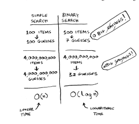
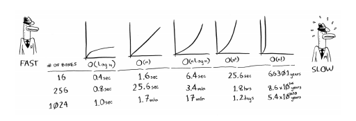

Peace, mercy and blessings of God I am Muhammad al-Mahdi, and God willing, this is the first video of a series
explaining the book Grokking Algorithms. The book is one of the simplest books that only require base knowledge of a
programming language and introduces you to very important topics that you will need and will benefit you, whatever
technology you will use or work with. This chapter is from the book, its purpose is to establish a foundation for the
rest of the book And we write together the first search Algorithm search for us (binary search)
And we are talking about the runtime complex of the algorithm BIG O So let's get started

The first thing we want to start talking about or know about is Algorithm What is Algorithm? Algorithm is a set of
commands that execute a certain task Accordingly, each piece of the code is nothing but Algorithm, and the book here
chose that it talks about Algorithm that are fast and solve interesting problems or both.

For example, now in chapter 1, we will talk about Binary Search, and we will see how you will speed up the time of an
operation from 4 billion to 32 only!

And chapter 6, 7 and 8, we will talk about the graphs and how to calculate the shortest way to your goal!

And how do you work Algorithm by playing the game of checkers using dynamic programming

So let's start with the first Algorithm in the book It is Binary Search Let's assume that you are looking at a word in
the dictionary, and this word begins with the letter O, for example Will you open the dictionary from the beginning or
not pass a pill like this? Surely you will pass the first pill or open it from the text This is the binary that will be
sprayed exactly, and this is the way to do if it is the Algorithm, and we will see why now And it's output is the
location of the element inside the views, OK, if it is not available? We will return null or -1

I wonder how you write? let's see If I told you now, we'll both play a guessing game I'm thinking of a number between 1
and 100, and you're supposed to guess it And you would guess like this 1 2 3 4, and so I will tell you every time your
number is greater or less than the number I am thinking of Ok, what do you think if I tell you that I will start at 50
and then say bigger or smaller? If I use the first method in the worst-case scenario, you will know my number after 100
guesses

Ok if you use the second method? I will lose a lot or arrive after 7 times Ok, let's write this code

Ok, we have now looked at two types of search engines, the first type is called linear search The second type is called
binary search, and of course it is clear which of them is faster and why or what is the reason for this

But this takes us to another very important need that we must take care of in our algorithm, which is the run time.
Let's take this table as an example

See how many times I need to run the search if n or log n!

So what is the Big O notation? It's a special notation that says how fast is my algorithm? Ok, why is this important?
Because it happens that we use joggers, we don't have much, and we must be aware that they are fast or slow, and the
following table has a graph that is more than the run times

And there are many others, of course, but these are the most famous and most widely used. With this, we have concluded
the first part of the book grokking algorithms. I hope the explanation will be useful and easy. Peace, mercy and
blessings of God be upon you.

